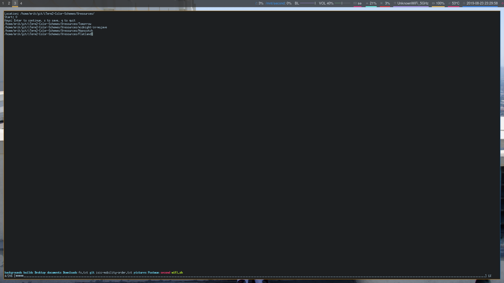

# A theme previewer for Xresource and base16 theme files
### Description
A program to preview .Xresource- or base16-files in a terminal.
Tested with following:
- [x] Urxvt
- [x] xterm
- [x] uxterm
- [ ] zsh
###
Should work in other terminals as long as dynamic colors is applied, for urxvt, you will need the following line:
```
URxvt*dynamicColors: on
```

### TODO List
- [x] Progress bar as well as directory listing
- [x] Translation from *.Xresource to colors in bash
- [x] Translation from base16-* files to colors in bash
- [x] Saving of current theme in .Xresource file located in ~/
- [x] Sending commands with for example ``` command:bash ```
- [ ] Translating other theme files to colors in bash

### Community functions
If you have any ideas for improving the script or just any feature to add, tell me don't be shy, I won't bite.
I am studying full time so I may not have time for everything, but will try to improve or implement it if it's valuable. 

## Example


## Extra
The file called "ThemePreviewer" is a man page which you can do either:
- [x] ``` man ./ThemePreviewer```
- [x] ``` man --local-file ThemePreviewer ```

