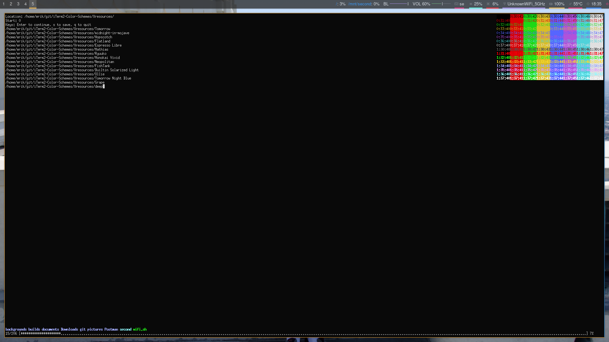
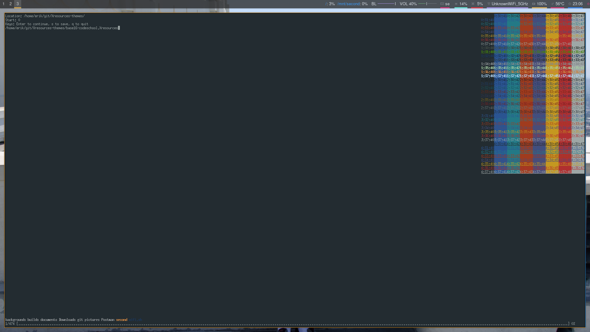

# A theme previewer for Xresource and base16 theme files
### Description
A program to preview .Xresource- or base16-files in a terminal.
Tested with following:
- [x] Urxvt
- [x] xterm
- [x] uxterm
###
Should work in other terminals as long as dynamic colors is applied, for urxvt, you will need the following line:
```
URxvt*dynamicColors: on
```

### TODO List
- [x] Progress bar as well as directory listing
- [x] Translation from *.Xresource to colors in bash
- [x] Translation from base16-* files to colors in bash
- [x] Saving of current theme in .Xresource file located in ~/
- [x] Sending commands with for example ``` command:bash ```
- [ ] Translating other theme files to colors in bash
- [ ] Fix usage of "command:" so that it makes use of pipes.

### Community functions
If you have any ideas for improving the script or just any feature to add, tell me don't be shy, I won't bite.
I am studying full time so I may not have time for everything, but will try to improve or implement it if it's valuable. 

## Example
### Example 1

### Example 2

### Example 3


## Extra
The file called "ThemePreviewer" is a man page which you can do one of following commands to view:
- [x] ``` man ./ThemePreviewer```
- [x] ``` man --local-file ThemePreviewer ```

# Recent Changes
- Added a block of colors starting in the top right corner so that you can see for all different types of text, backgrounds and colors of the text how it looks, see the last example.
- Updated "command:" so that it can take arguments, doesn't give output if bash is used. Also using pipes are experimental until I have come up with a fix for it
